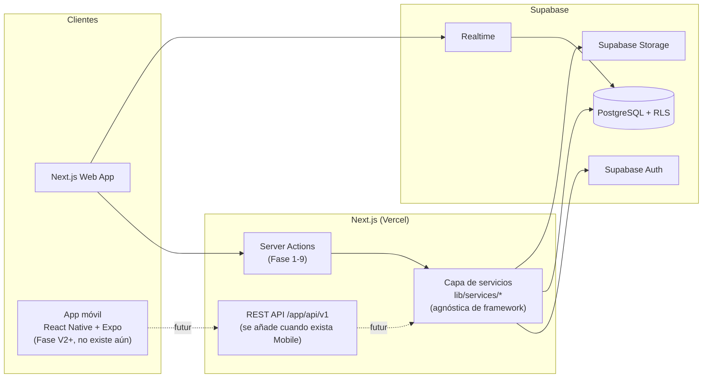

# Arquitectura — ROOMLY

Monolito Next.js bien estructurado. Nada de microservicios, nada de colas,
nada de infraestructura distribuida — no hay ninguna razón de negocio hoy
que lo justifique (sección 44 del brief).

## Diagrama de flujo



## Separación frontend/backend

Mismo repositorio (monolito, sección 44 del brief), pero frontera de
responsabilidad clara: el frontend (componentes de servidor y de
cliente de Next.js) **nunca** habla directamente con Postgres ni usa la
`service_role key` — todo pasa por Server Actions (hoy) o por la API
REST (cuando exista Mobile). Un componente cliente solo ve el cliente
Supabase con la `anon key`, sujeto siempre a RLS; el acceso privilegiado
vive exclusivamente en código server-only.

### Decisión central: capa de servicios, no API primero

El brief pide explícitamente no duplicar backend cuando llegue la app móvil
(sección 25). La forma de cumplir eso **sin** construir una API REST completa
que hoy no usa nadie (eso sí sería sobreingeniería) es:

```
app/actions/*.ts   → Server Actions (delgadas, solo Next.js)
        ↓ llaman a
lib/services/*.ts  → lógica de negocio real (validación, orquestación, reglas)
        ↓ usa
lib/supabase/*.ts  → clientes Supabase (browser / server / admin)
```

Cuando exista la app Expo, se añade `app/api/v1/*/route.ts` como una capa
fina adicional que llama a los **mismos** `lib/services/*` — cero lógica de
negocio reescrita, solo un wrapper HTTP nuevo. Hasta entonces, esa carpeta
`app/api/` solo tiene webhooks (ninguno en el MVP todavía).

**Regla para evitar N+1**: la capa de servicios usa siempre `select` anidados
de Supabase/PostgREST (o una vista/join explícito) para listados con
relaciones — nunca un fetch dentro de un bucle. Esto es una convención de
`CLAUDE.md`, no algo que se pueda reforzar solo con el esquema.

## Motor de matching: función pura, no IA, no SQL

`lib/matching/score.ts` — una función determinista en TypeScript:

```ts
function calculateCompatibility(
  a: CompatibilityProfile,
  b: CompatibilityProfile,
  weights: MatchWeights
): MatchResult // { overallScore, categoryScores, strengths, differences }
```

Vive en TypeScript (no en un trigger de Postgres) por una razón concreta:
la misma función se usa tanto para "explorar candidatos" (antes de que exista
ningún interés) como para calcular el score que se guarda en `matches` al
confirmarse un match. Reimplementar el algoritmo en PL/pgSQL duplicaría la
lógica en dos lenguajes con riesgo real de que diverjan. Los pesos
(sección 9 del brief) viven en `lib/matching/weights.ts` como un objeto
tipado versionado en git — "fácilmente modificable" (lo que pide el brief)
no exige una UI de administración en el MVP; editar un archivo y desplegar
ya lo cumple. Si en V2/V3 alguien no técnico necesita ajustar pesos sin
depender de un despliegue, ese es el momento de mover los pesos a una tabla
— la función ya los recibe como parámetro, así que ese cambio no toca la
firma de `calculateCompatibility`.

## Autenticación

Supabase Auth. Proveedores: email + Google + Apple (sección 6).

**Para "email" recomiendo magic link (passwordless) en vez de contraseña**:
menos superficie de ataque (no hay contraseñas que filtrar ni flujos de
"olvidé mi contraseña" que mantener), y el email queda verificado por el
simple hecho de haber pulsado el enlace — el badge "email verificado"
(sección 18) sale gratis. La contrapartida honesta: depende de que el
correo llegue rápido, así que la fiabilidad del proveedor de email (Resend
o el SMTP de Supabase) importa más que con contraseña. Si prefieres
email+contraseña, es un cambio de configuración en Supabase Auth, no de
arquitectura.

## Autorización

Modelo de roles simple: `profiles.role` (`user` | `admin`), comprobado en
RLS vía la función `is_admin()` (ver DATABASE.md). La ruta `/admin` se
protege **dos veces**: RLS en la base de datos, y una comprobación de rol
en el servidor (`proxy.ts` exige sesión; `app/admin/layout.tsx` comprueba el rol) antes de renderizar
nada — nunca solo ocultar el enlace en el cliente. `docs/SECURITY.md`
tiene el mapa punto por punto de qué política cubre cada requisito de
autorización pedido (datos propios, mensajes entre participantes,
habitaciones del propietario, admin separado, información privada). No
hay roles intermedios (moderador, propietario profesional...) en el MVP
— el enum `user_role` se amplía sin romper nada cuando la sección 4 del
brief los necesite de verdad.

## Chat en tiempo real

Supabase Realtime (change data capture sobre `messages`) en vez de
infraestructura de websockets propia. Cero servidores nuevos que mantener,
y cubre 1 a 1 y grupo por igual gracias a `conversation_participants`.

## Administración

Ruta protegida `/admin` (ver Autorización arriba). Cuatro áreas, tal
como pide la sección 20 del brief:

- **Usuarios**: buscar, filtrar, verificar (badge de email), bloquear
  (soft-delete + revocar sesión).
- **Habitaciones**: revisar, ocultar (`status = 'paused'`), eliminar
  (soft-delete), marcar como sospechosa.
- **Reportes**: listar por `status`, revisar, resolver (con
  `resolution_notes`).
- **Métricas**: usuarios registrados/activos, habitaciones, matches,
  conversaciones, reportes, conversión del funnel (ver Analytics).

Toda acción de moderación se escribe en `admin_action_logs` sin
excepción (ver `docs/SECURITY.md`). Un único rol `admin` con acceso
completo es suficiente mientras el equipo sea pequeño — roles de
moderador separados quedan para cuando el brief los necesite de verdad
(sección 4).

## Notificaciones

Dos canales en el MVP, un tercero preparado pero no construido:

- **In-app**: tabla `notifications` (bandeja, no leídos vía
  `read_at is null`).
- **Email**: efecto lateral disparado desde `lib/services/*` tras la
  acción que lo origina (nuevo match, nuevo mensaje, nuevo interés,
  habitación compatible, recordatorio de perfil incompleto — los 5 tipos
  del MVP), enviado con Resend. Respeta
  `profiles.email_notifications_enabled` — si está a `false`, el
  servicio ni siquiera intenta el envío.
- **Push**: no existe hasta que exista la app móvil (V2). La columna de
  preferencia se añade junto con el propio canal, no antes — ver en
  `docs/DATABASE.md` por qué no se construye ya una tabla de
  preferencias granular sin un canal real que la use.

La plantilla de cada email vive en `lib/email/`, no inline en el Server
Action, para poder testearla sin disparar un envío real.

## Analytics

PostHog, región EU. Dos vías de captura, porque una sola no es fiable:

- **Cliente** (`posthog-js`): eventos de interacción —
  `room_viewed`, `match_viewed`, clics de exploración.
- **Servidor** (`posthog-node`, desde `lib/services/*`): eventos de
  conversión de negocio — `signup_completed`, `test_completed`,
  `interest_sent`, `match_created`, `room_created`... Se capturan en
  servidor porque son los que de verdad importan para el funnel
  (sección 36 del brief) y un bloqueador de anuncios no debe poder
  hacerlos desaparecer de las métricas.

Funnel instrumentado tal como pide la sección 35: visita → registro →
perfil → test → match → contacto → conversación → vivienda. La métrica
que de verdad importa (sección 36) no es volumen de registros, es el
**porcentaje de usuarios que llegan a un match relevante** — se calcula
sobre estos eventos, no aparte. No se instrumenta nada más "por si
acaso": la lista de eventos es la de la sección 35, ni más ni menos,
hasta que el análisis real pida algo distinto.

## Imágenes

Supabase Storage. Bucket de lectura pública para fotos de habitación y
avatares (nada sensible en una foto de un piso), escritura restringida por
política de Storage a rutas prefijadas con el `auth.uid()` del propietario,
con límite de tamaño y tipo MIME validado tanto en el bucket como en la
capa Zod antes de subir.

## SEO

Páginas `/[ciudad]/habitaciones` y `/[ciudad]/companeros-de-piso` con
`generateStaticParams` limitado a `cities.is_active = true` + ISR
(revalidación incremental), no generación estática de miles de páginas
vacías. La vista pública `public_profile_previews` (ver DATABASE.md) es lo
que permite que estas páginas sean rastreables sin sesión sin reabrir el
acceso público a `profiles` completo.

## Estructura de carpetas

Los segmentos de ruta orientados a usuario van en español (para que las
URLs coincidan con el SEO que pide la sección 34); el código interno
(`lib/`, `components/`, nombres de archivo) va en inglés, convención
estándar de la industria.

```
roomly/
├── app/
│   ├── (marketing)/[city]/{habitaciones,companeros-de-piso}/
│   ├── (auth)/{login,registro,callback}/
│   ├── (onboarding)/{perfil,test,preferencias}/
│   ├── (app)/{matches,explorar,habitaciones,mensajes,perfil,ajustes}/
│   ├── admin/{usuarios,habitaciones,reportes,metricas}/
│   ├── api/webhooks/          # vacío en MVP; api/v1 se añade con Mobile
│   └── actions/                # Server Actions, delgadas
├── lib/
│   ├── supabase/{client,server,admin}.ts
│   ├── matching/{score,weights,types}.ts
│   ├── services/                # lógica de negocio real
│   ├── validation/               # esquemas Zod
│   ├── email/
│   └── utils/
├── components/{ui,profile,matches,rooms,chat,admin}/
├── types/
├── supabase/{migrations,seed.sql}
├── tests/{unit,integration,e2e}
└── public/
```

(Árbol completo generado en el sandbox — consultable con `find` en
`/home/claude/roomly` o revisando el commit inicial en git.)

**Calidad de código**: ESLint con la configuración recomendada de
Next.js + reglas de TypeScript estrictas, Prettier con configuración por
defecto. Se materializan como archivos de config reales en Fase 1, junto
con `package.json` — no antes, para no dejar configuración huérfana sin
proyecto que la use.

## Cómo escala esto (sin optimizar prematuramente)

- **100 → 10.000 usuarios**: nada cambia. Índices ya puestos en las columnas
  de filtro (`rooms.city_id`, `interests.to_user_id`...), paginación en
  todos los listados desde el día uno.
- **10.000 → 100.000**: el matching sigue siendo viable porque el filtro
  duro (ciudad + fechas + presupuesto, todo indexado) acota el candidato
  antes de puntuar — nunca se puntúa "toda la base de usuarios". Si el
  filtro deja de acotar lo suficiente (ciudad muy grande, fechas muy
  amplias), el siguiente paso es precalcular/cachear matches en background,
  sin tocar la interfaz pública de la capa de servicios.
- **Imágenes**: Storage externo desde el día uno (nunca en la base de
  datos ni en el repo), compresión en la subida.

## Lo que NO se construye ahora (y por qué no es un olvido)

Pagos, contratos, KYC de terceros, videollamadas, IA generativa para
matching, multi-idioma, monorepo/Turborepo — todo esto está listado en la
sección 51/52 del brief como fuera del MVP, y esta arquitectura los deja
como extensión natural (nuevas tablas, nuevo wrapper de API, nuevo paquete)
en vez de como reescritura. No se empieza a construir nada de esto hasta
que haya demanda real.
