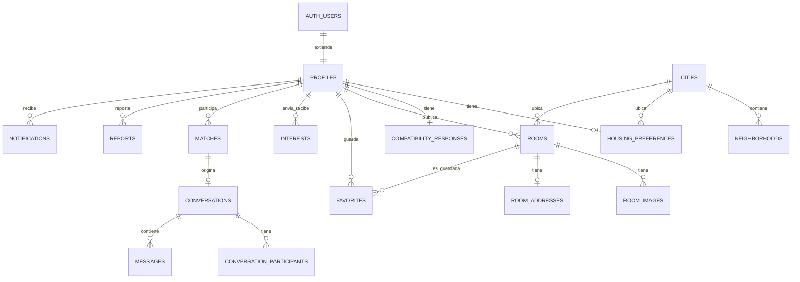

# Base de datos — ROOMLY

PostgreSQL (Supabase). UUID como PK en todas las tablas. `created_at`/`updated_at`
donde aplica. Soft delete (`deleted_at`) en `profiles` y `rooms` — el resto se
borra en duro o se conserva sin restricción (ver "Soft delete vs. GDPR" abajo).

El SQL real vive en `supabase/migrations/` (dos archivos: esquema y políticas RLS)
y `supabase/seed.sql`. Este documento explica las decisiones; el código fuente
de la verdad es el SQL.

## Revisión crítica (lo que se encontró y se corrigió)

Este esquema pasó por una segunda pasada adversarial antes de darlo por bueno.
Esto es lo que cambió:

### Sobreingeniería eliminada

| Se quita | Por qué estaba de más |
|---|---|
| Tabla `verifications` (email/universidad/identidad/vivienda) | El MVP solo verifica email (sección 18 del brief: "No implementar KYC complejo en el MVP"). Email verificado ya lo da gratis `auth.users.email_confirmed_at` de Supabase. Construir una tabla extensible para 3 tipos de verificación que no tienen ningún flujo detrás es infraestructura para una función que no existe todavía. Se añade en V2/V3 cuando haya un proveedor de KYC real que la necesite. |
| Tabla `notification_preferences` con JSONB granular | El MVP tiene 5 tipos de notificación. Preferencias por tipo con UI propia es una funcionalidad de configuración real que nadie pidió construir todavía. Una columna `profiles.email_notifications_enabled boolean` cubre la sección 21 ("no enviar spam, crear preferencias") sin construir un sistema de preferencias granular sin usuarios que lo reclamen. |

### Riesgos de seguridad corregidos

| Riesgo | Corrección |
|---|---|
| `profiles` era legible por cualquiera, incluso sin sesión — nombre, bio, fecha de nacimiento de cada usuario quedaban rascables por bots anónimos. | El SELECT completo ahora exige `auth.uid() is not null`. Para que las páginas SEO públicas (`/barcelona/habitaciones`) sigan siendo rastreables por Google sin sesión, se añadió la vista `public_profile_previews` (solo id, nombre, avatar, rol) con permiso explícito para `anon`. |
| Nada impedía que un usuario (o un bot) enviara cientos de "me interesa" por minuto — vector de spam/acoso. | Trigger `enforce_interest_rate_limit` en `interests`: tope de 30 por usuario cada 24h a nivel de base de datos, como backstop además del check "amigable" que hará la UI. |
| Sin una regla explícita, alguien podría añadir sin querer una política de INSERT en `matches` o `conversation_participants` y permitir que un cliente se "auto-matchee" o se cuele en una conversación ajena. | Se documenta explícitamente en el SQL que la ausencia de política de INSERT en `matches`/`conversations`/`conversation_participants` es intencional: esas filas solo las crea el servidor tras verificar interés mutuo. |
| La dirección exacta de una habitación vivía en la misma tabla que el resto de campos públicos — un `SELECT *` mal escrito en cualquier punto del código la habría filtrado. | Se movió a `room_addresses`, tabla propia con su propia política RLS (solo el propietario). Es el único campo de todo el esquema cuya fuga tiene una consecuencia física (localizar dónde vive alguien), así que es el único que se protege a nivel de base de datos y no solo "acordándose" de proyectar las columnas correctas en el código. |

### Riesgos de escalabilidad abordados

- **Matching a 100.000 usuarios**: el candidato a puntuar nunca es "todos los usuarios". Antes de calcular ningún score, se filtra por índices (`city_id`, fechas solapadas, rango de presupuesto) — eso acota el conjunto a decenas o cientos de perfiles como mucho, incluso a gran escala. El cálculo de compatibilidad (caro, en TypeScript) solo corre sobre ese conjunto ya acotado. Si en el futuro esto no basta, el siguiente paso natural es precalcular/cachear matches en un job en background — la capa de servicios ya está diseñada para que ese cambio no toque la API pública (ver ARCHITECTURE.md).
- **Condición de carrera al crear un match**: dos interstore simultáneos (A→B y B→A casi a la vez) pueden disparar dos intentos de crear el mismo match. El constraint `unique (user_a_id, user_b_id)` lo hace seguro: el segundo intento falla por duplicado, y la app debe tratar ese error como "ya existe" (`ON CONFLICT DO NOTHING` o equivalente), no como un fallo real.
- **N+1 en listados** (habitaciones con fotos, matches con perfil+preferencias+test): la capa de servicios debe usar los `select` anidados de Supabase/PostgREST o joins explícitos, nunca un fetch por fila dentro de un bucle. Se deja como regla explícita en `CLAUDE.md`.

### Lo que se revisó y se decidió mantener (no es sobreingeniería)

- **`room_addresses` como tabla separada**: sobrevive la revisión porque protege el único campo con consecuencia de seguridad física, no por "arquitectura elegante".
- **`admin_action_logs`**: una sola tabla append-only, sin lógica compleja. El panel admin puede bloquear personas y resolver reportes — sin trazabilidad de eso, no hay manera de auditar un abuso del propio panel. Coste bajo, valor de confianza alto.
- **18 tablas en total**: el número en sí no es el riesgo — cada una responde a una sección explícita del brief (habitaciones, interés, chat, reportes, admin). El riesgo real era construir infraestructura sin función detrás (lo que sí se cortó arriba), no el conteo de tablas.

### Mapeo con los nombres de tabla pedidos

Se ha pedido explícitamente un esquema para `users`, `preferences` y
`verification_status` con esos nombres literales. Mantengo la decisión
de la revisión anterior sobre las tres, pero la dejo explícita aquí para
que la confirmes o la corrijas directamente:

| Nombre pedido | Qué hay en su lugar | Por qué |
|---|---|---|
| `users` | `auth.users` (gestionada por Supabase) + `profiles` (FK 1:1 a `auth.users.id`) | `auth.users` ya guarda credenciales, email y proveedores OAuth. Una tabla `users` propia sería una copia que se puede desincronizar. En la práctica sigue existiendo "un registro de usuario" — la mitad la gestiona Supabase Auth y la mitad `profiles`. |
| `preferences` | `housing_preferences` | Mismo concepto, nombre más específico (conviven con preferencias de notificación, respuestas del test...). Todas las columnas pedidas — presupuesto, fechas, zona, número de compañeros — están ahí. |
| `verification_status` | No existe como tabla. `auth.users.email_confirmed_at` cubre la única verificación real del MVP. | El resto de badges (universidad, identidad, vivienda) no tienen ningún flujo funcional detrás todavía — el propio brief dice "no KYC complejo en el MVP" (sección 18). |

Si prefieres los tres nombres tal cual se pidieron, es un cambio pequeño
en el SQL (crear `verifications` con `user_id`/`type`/`status`/`verified_at`
es cosa de diez minutos) — no hay nada técnicamente forzoso en esta
elección, es una opinión de diseño que se puede anular sin fricción.
Dímelo y lo ajusto antes de Fase 1.

## Diagrama de entidades (simplificado)

## Tablas por dominio

**Referencia** — `cities`, `neighborhoods`, `universities`. Lectura pública total, escritura solo admin. `cities.is_active` controla qué ciudades están "live" (solo Barcelona al lanzar).

**Identidad** — `profiles` (extiende `auth.users`; identidad/bio, nunca credenciales — esas las gestiona Supabase Auth), `housing_preferences` (criterios de búsqueda: presupuesto, fechas, zonas, ciudad, universidad), `compatibility_responses` (respuestas del test, JSONB versionado).

**Habitaciones** — `rooms`, `room_images`, `room_addresses` (dirección exacta, aislada), `favorites`.

**Interés y matching** — `interests` (unifica interés en persona e interés vía habitación), `matches` (creado solo desde el servidor).

**Chat** — `conversations`, `conversation_participants` (tabla de unión, no columnas fijas — permite grupo más adelante), `messages`.

**Confianza y seguridad** — `reports`, `admin_action_logs`.

**Notificaciones** — `notifications` (in-app; el email es un efecto lateral del servicio, no una tabla).

## Convenciones

- Nombres de tabla en plural, en inglés (estándar de la industria — igual que ya hacía el propio brief en su lista de entidades).
- `text` en vez de `varchar(n)`: Postgres no penaliza `text`, y evita migraciones para ampliar límites arbitrarios.
- Dinero como `integer` en euros enteros (sin céntimos) — el mercado de alquiler de habitaciones no necesita precisión decimal, y evita problemas de punto flotante.
- `report_reason` y `notification_type` son `text`, no `enum`: es más probable que este catálogo crezca con el producto que el de `room_status` o `user_role`, y añadir un valor no debe requerir una migración de tipo.

## Soft delete vs. borrado real (RGPD)

`deleted_at` en `profiles`/`rooms` es una herramienta de **producto** (ventana de deshacer, no romper integridad referencial de matches/conversaciones existentes) — **no** satisface por sí sola el derecho al olvido del RGPD, porque el dato personal sigue existiendo físicamente, solo queda oculto.

**REQUIERE REVISIÓN LEGAL**: el diseño técnico anticipa un job periódico que, pasado un plazo de gracia tras el soft-delete, anonimice o elimine en duro los campos personales (nombre, foto, bio, mensajes) de una cuenta borrada. El plazo exacto y qué campos deben anonimizarse vs. eliminarse (p. ej. los mensajes de una conversación donde el otro participante no ha borrado su cuenta) son decisiones legales, no técnicas — no las fijamos aquí.

## Edad mínima

Se añadió `constraint chk_min_age` en `profiles` (18 años cumplidos) como puerta técnica por defecto, dado el público objetivo (18-30 años) y que más adelante habrá contratos. **REQUIERE REVISIÓN LEGAL** para confirmar que 18 es el umbral correcto y si hace falta algo adicional de verificación de edad más allá de autodeclaración.
