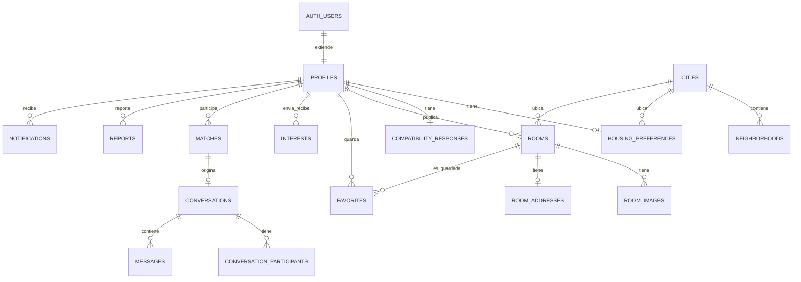

# Base de datos — ROOMLY

PostgreSQL (Supabase). UUID como PK en todas las tablas. `created_at`/`updated_at`
donde aplica. Soft delete (`deleted_at`) en `profiles` y `rooms` — el resto se
borra en duro o se conserva sin restricción (ver "Soft delete vs. GDPR" abajo).

El SQL real vive en `supabase/migrations/` (el esquema, las políticas RLS, las
correcciones de la auditoría inicial y las migraciones incrementales de las
Fases 2 y 3) y `supabase/seed.sql`. Este documento explica las decisiones; el código fuente
de la verdad es el SQL.

## Revisión crítica (lo que se encontró y se corrigió)

Este esquema pasó por una segunda pasada adversarial antes de darlo por bueno.
Esto es lo que cambió:

### Sobreingeniería eliminada

| Se quita | Por qué estaba de más |
|---|---|
| Tabla `verifications` (email/universidad/identidad/vivienda) | El MVP solo verifica email (sección 18 del brief: "No implementar KYC complejo en el MVP"). Email verificado ya lo da gratis `auth.users.email_confirmed_at` de Supabase. Construir una tabla extensible para 3 tipos de verificación que no tienen ningún flujo detrás es infraestructura para una función que no existe todavía. Se añade en V2/V3 cuando haya un proveedor de KYC real que la necesite. |
| Tabla `notification_preferences` con JSONB granular | El MVP tiene 5 tipos de notificación. Preferencias por tipo con UI propia es una funcionalidad de configuración real que nadie pidió construir todavía. Una columna `profiles.email_notifications_enabled boolean` cubre la sección 21 ("no enviar spam, crear preferencias") sin construir un sistema de preferencias granular sin usuarios que lo reclamen. |

### Riesgos de seguridad corregidos

| Riesgo | Corrección |
|---|---|
| `profiles` era legible por cualquiera, incluso sin sesión — nombre, bio, fecha de nacimiento de cada usuario quedaban rascables por bots anónimos. | El SELECT completo ahora exige `auth.uid() is not null`. Para que las páginas SEO públicas (`/barcelona/habitaciones`) sigan siendo rastreables por Google sin sesión, se añadió la vista `public_profile_previews` (solo id, nombre, avatar, rol) con permiso explícito para `anon`. **Actualización (Fase 2.9, H4)**: ya no basta con tener sesión; cada usuario lee solo su perfil (ver "Fase 2.9 — H4"). |
| Nada impedía que un usuario (o un bot) enviara cientos de "me interesa" por minuto — vector de spam/acoso. | Trigger `enforce_interest_rate_limit` en `interests`: tope de 30 por usuario cada 24h a nivel de base de datos, como backstop además del check "amigable" que hará la UI. |
| Sin una regla explícita, alguien podría añadir sin querer una política de INSERT en `matches` o `conversation_participants` y permitir que un cliente se "auto-matchee" o se cuele en una conversación ajena. | Se documenta explícitamente en el SQL que la ausencia de política de INSERT en `matches`/`conversations`/`conversation_participants` es intencional: esas filas solo las crea el servidor tras verificar interés mutuo. |
| La dirección exacta de una habitación vivía en la misma tabla que el resto de campos públicos — un `SELECT *` mal escrito en cualquier punto del código la habría filtrado. | Se movió a `room_addresses`, tabla propia con su propia política RLS (solo el propietario). Es el único campo de todo el esquema cuya fuga tiene una consecuencia física (localizar dónde vive alguien), así que es el único que se protege a nivel de base de datos y no solo "acordándose" de proyectar las columnas correctas en el código. |

### Riesgos de escalabilidad abordados

- **Matching a 100.000 usuarios**: el candidato a puntuar nunca es "todos los usuarios". Antes de calcular ningún score, se filtra por índices (`city_id`, fechas solapadas, rango de presupuesto) — eso acota el conjunto a decenas o cientos de perfiles como mucho, incluso a gran escala. El cálculo de compatibilidad (caro, en TypeScript) solo corre sobre ese conjunto ya acotado. Si en el futuro esto no basta, el siguiente paso natural es precalcular/cachear matches en un job en background — la capa de servicios ya está diseñada para que ese cambio no toque la API pública (ver ARCHITECTURE.md).
- **Condición de carrera al crear un match**: dos interstore simultáneos (A→B y B→A casi a la vez) pueden disparar dos intentos de crear el mismo match. El constraint `unique (user_a_id, user_b_id)` lo hace seguro: el segundo intento falla por duplicado, y la app debe tratar ese error como "ya existe" (`ON CONFLICT DO NOTHING` o equivalente), no como un fallo real.
- **N+1 en listados** (habitaciones con fotos, matches con perfil+preferencias+test): la capa de servicios debe usar los `select` anidados de Supabase/PostgREST o joins explícitos, nunca un fetch por fila dentro de un bucle. Se deja como regla explícita en `CLAUDE.md`.

### Lo que se revisó y se decidió mantener (no es sobreingeniería)

- **`room_addresses` como tabla separada**: sobrevive la revisión porque protege el único campo con consecuencia de seguridad física, no por "arquitectura elegante".
- **`admin_action_logs`**: una sola tabla append-only, sin lógica compleja. El panel admin puede bloquear personas y resolver reportes — sin trazabilidad de eso, no hay manera de auditar un abuso del propio panel. Coste bajo, valor de confianza alto.
- **18 tablas en total**: el número en sí no es el riesgo — cada una responde a una sección explícita del brief (habitaciones, interés, chat, reportes, admin). El riesgo real era construir infraestructura sin función detrás (lo que sí se cortó arriba), no el conteo de tablas.

### Mapeo con los nombres de tabla pedidos

Se ha pedido explícitamente un esquema para `users`, `preferences` y
`verification_status` con esos nombres literales. Mantengo la decisión
de la revisión anterior sobre las tres, pero la dejo explícita aquí para
que la confirmes o la corrijas directamente:

| Nombre pedido | Qué hay en su lugar | Por qué |
|---|---|---|
| `users` | `auth.users` (gestionada por Supabase) + `profiles` (FK 1:1 a `auth.users.id`) | `auth.users` ya guarda credenciales, email y proveedores OAuth. Una tabla `users` propia sería una copia que se puede desincronizar. En la práctica sigue existiendo "un registro de usuario" — la mitad la gestiona Supabase Auth y la mitad `profiles`. |
| `preferences` | `housing_preferences` | Mismo concepto, nombre más específico (conviven con preferencias de notificación, respuestas del test...). Todas las columnas pedidas — presupuesto, fechas, zona, número de compañeros — están ahí. |
| `verification_status` | No existe como tabla. `auth.users.email_confirmed_at` cubre la única verificación real del MVP. | El resto de badges (universidad, identidad, vivienda) no tienen ningún flujo funcional detrás todavía — el propio brief dice "no KYC complejo en el MVP" (sección 18). |

Si prefieres los tres nombres tal cual se pidieron, es un cambio pequeño
en el SQL (crear `verifications` con `user_id`/`type`/`status`/`verified_at`
es cosa de diez minutos) — no hay nada técnicamente forzoso en esta
elección, es una opinión de diseño que se puede anular sin fricción.
Dímelo y lo ajusto antes de Fase 1.

## Comprobación de coherencia final (antes de Fase 1)

Auditoría punto por punto contra `ARCHITECTURE.md`, `SECURITY.md`,
`ROADMAP.md` y el SQL, pedida explícitamente antes de confirmar el
esquema. 5 problemas reales encontrados, los 5 ya corregidos en el SQL
(no solo documentados aquí):

| # | Problema encontrado | Corrección |
|---|---|---|
| 1 | `rooms` no tenía columnas propias para "mascotas", "fumadores" ni "estudiantes" — tres filtros que la sección 13 del brief pide explícitamente. Solo existían, si acaso, como texto libre dentro de `features`, no fiable para filtrar. | Añadidas `pets_allowed`, `smoking_allowed`, `students_only` (boolean, `not null default false`) |
| 2 | Sin índice GIN en `rooms.features`, el filtro por "características" habría hecho un escaneo completo de la tabla a partir de cierto volumen. | Añadido `idx_rooms_features` |
| 3 | `conversation_participants` no tenía índice por `user_id` — el PK `(conversation_id, user_id)` no sirve para la consulta más frecuente del chat: "mis conversaciones". | Añadido `idx_conversation_participants_user` |
| 4 | Sin índice en `favorites.room_id`, contar cuántas veces se guardó una habitación (métrica de admin) habría sido lento a escala. | Añadido `idx_favorites_room` |
| 5 | **Escalado de privilegios real**: `profiles_update_own` y `participants_update_own` usaban `using` sin `with check`. RLS filtra filas, no columnas — nada impedía `update profiles set role = 'admin' where id = auth.uid()`, ni que un usuario "saltara" a cualquier conversación cambiando `conversation_id` en su propia fila de `conversation_participants`. | Restricción de columnas actualizables vía `GRANT`/`REVOKE` (detalle en `docs/SECURITY.md` y en el propio SQL): `authenticated` ya no tiene privilegio de `UPDATE` sobre `profiles.role` ni `conversation_participants.conversation_id`. También se reforzó el `INSERT` de `admin_action_logs`, que antes permitía a un admin atribuir una acción a otro admin. |

Ninguno de estos 5 cambios añade tablas, cambia nombres ni introduce
funcionalidad nueva — son índices y restricciones sobre el esquema ya
confirmado. El punto 5 es el único crítico: sin él, cualquier usuario
podía auto-promocionarse a admin.

## Correcciones de la auditoría inicial (2026-09-26)

La corrección del punto 5 de arriba resultó incompleta, y aparecieron
otros problemas al aplicar por primera vez el SQL en un PostgreSQL real.
Todo se corrige en `supabase/migrations/20260926120000_security_fixes.sql`
(migración nueva; las dos anteriores no se tocan) y cada punto tiene test
de regresión en `tests/db/`. Detalle y razonamiento en `docs/SECURITY.md`
§"Correcciones de la auditoría inicial".

- `profiles`: `INSERT` restringido por columnas (sin `role`/`deleted_at`)
  + `with check (role = 'user')`. Cerraba la auto-promoción a admin vía
  `INSERT`, que el punto 5 no cubría.
- Chat: nueva función `public.is_conversation_participant(uuid)`
  (`SECURITY DEFINER`, `search_path` vacío, sin parámetro de usuario). Las
  políticas de `messages`, `conversations` y `conversation_participants`
  la usan en vez de subconsultas: elimina la recursión infinita y una
  referencia ambigua a `conversation_id` que daba acceso a todas las
  conversaciones.
- `rooms`: trigger `trg_rooms_moderation` — solo un admin (o el servidor)
  cambia el estado desde o hacia `removed`.
- `reports`: `INSERT` restringido por columnas; quien reporta no puede
  fijar `status`, `resolved_by`, `resolved_at` ni `resolution_notes`.

Siguen siendo 18 tablas y 35 políticas (8 redefinidas). Se añaden 2
funciones (`is_conversation_participant`, `enforce_room_moderation`) y
1 trigger (`trg_rooms_moderation`).

## Fase 2.0 — endurecimiento de datos (2026-09-29)

Migración `supabase/migrations/20260929120000_phase2_data_hardening.sql`
(nueva; las anteriores no se tocan). Motivo: M4, porque una escritura
directa vía PostgREST se salta Zod y la base de datos es la última
barrera. No relaja ninguna política.

| Tabla | Constraint | Regla |
|---|---|---|
| `profiles` | `chk_profiles_full_name` | `btrim(full_name)` entre 1 y 100 caracteres |
| `profiles` | `chk_profiles_bio_length` | `bio` nula o ≤ 500 caracteres |
| `profiles` | `chk_profiles_avatar_url` | `avatar_url` nula, o `https://…` de ≤ 2048 caracteres (impide `javascript:`/`data:` en una columna que escribe el propio usuario) |
| `housing_preferences` | `chk_housing_preferences_field_of_study` | nulo, o `btrim` entre 1 y 120 caracteres |
| `housing_preferences` | `chk_housing_preferences_budget_max_nonneg` | `budget_max` ≥ 0. Junto con los ya existentes `chk_budget_positive` (`budget_min` ≥ 0) y `chk_budget_range` (`budget_min` ≤ `budget_max`) |
| `housing_preferences` | `chk_housing_preferences_roommates` | mínimo y máximo ≥ 0, y mínimo ≤ máximo |

**Sin techos, a propósito**: presupuesto, número de compañeros y número de
barrios preferidos no tienen máximo. Se valoraron topes (se propusieron y
se descartaron el 2026-09-29) porque la especificación no define ninguno.
Cualquier límite futuro tiene que ser una decisión explícita de producto,
no un valor técnico. El array de barrios sigue siendo `uuid[]` `NOT NULL`
y admite estar vacío.

Sin cambios: `seeking_status` ya es un enum; `date_of_birth` ya tiene
`chk_min_age`; `city_id` y `university_id` ya son FKs (una ciudad o
universidad inexistente se rechaza con `23503`).

Permisos de `housing_preferences` (detalle en `docs/SECURITY.md`): GRANT
por columnas, `profile_id` fuera del UPDATE y `anon` sin ningún privilegio.
Como en `profiles` (PR8), `upsert()` no sirve para esta tabla: los
servicios de Fase 2 harán INSERT y UPDATE por separado.

**Integridad de `preferred_neighborhood_ids`: triggers en las dos
direcciones** (decisión del usuario; se descartó la tabla intermedia para
no cambiar el esquema). Por qué no un CHECK ni una FK: comprobado en
PostgreSQL 16, un CHECK no admite subconsultas (`cannot use subquery in
check constraint`) y no existen FKs sobre elementos de un array (`uuid[]`
frente a `uuid`). Un CHECK que llamara a una función declarada `immutable`
con una consulta dentro sería una constraint falsa (Postgres no la
revalida) y se descartó.

- `trg_housing_preferences_neighborhoods` (`BEFORE INSERT OR UPDATE OF
  city_id, preferred_neighborhood_ids` en `housing_preferences`):
  - array vacío (el default; la columna es `NOT NULL`) → se acepta;
  - barrios con `city_id` nulo → `23514`;
  - algún UUID inexistente o `NULL` dentro del array → `23503`;
  - algún barrio de otra ciudad → `23514`. Cubre también cambiar
    `city_id` dejando barrios de la ciudad anterior.
- `trg_neighborhoods_not_referenced` (`BEFORE DELETE OR UPDATE OF id,
  city_id` en `neighborhoods`): si alguna preferencia usa el barrio,
  borrarlo, cambiarle el `id` o moverlo de ciudad falla con `23503`
  (`neighborhood_in_use`). **Sin cascadas**: quien administra decide qué
  hacer con esas preferencias antes. Renombrarlo sí se permite. También
  bloquea borrar una ciudad con barrios en uso (su borrado en cascada de
  barrios dispara el trigger).

Limitación conocida: no hay bloqueo entre las dos comprobaciones, así que
una escritura de preferencias y un borrado de barrio simultáneos podrían
cruzarse. Se acepta: solo un admin borra barrios, es raro, y la siguiente
escritura de esa fila la vuelve a validar. La comprobación inversa recorre
`housing_preferences` sin índice sobre el array; si crece, se añade un
índice GIN.

## Fase 2.3 — integridad del onboarding (2026-09-30)

Migración `supabase/migrations/20260930120000_phase2_onboarding_integrity.sql`
(nueva; no toca RLS ni GRANT). Decisiones del usuario:

- **`profiles.seeking_status` sin DEFAULT** (sigue `NOT NULL`). Antes, una
  fila creada sin enviarlo quedaba con `'flexible'`, indistinguible de una
  elección real. Ahora todo INSERT tiene que enviarlo (`23502` si falta), así
  que cualquier valor guardado fue enviado explícitamente. Sin datos que
  migrar. Consecuencia: los INSERT de perfiles de tests y fixtures envían
  `seeking_status`, y `profiles.Insert` lo exige en `types/database.ts`.
- **`trg_profiles_onboarding_completion`** (`BEFORE INSERT OR UPDATE OF
  onboarding_completed_at` en `profiles`): si el valor pasa a no nulo, exige
  una fila de `housing_preferences` del mismo perfil con `city_id`; si no,
  `23514` (`onboarding_incomplete:`). Poner la columna a `NULL` o no tocarla
  no se comprueba. **Actualización (Fase 2.9)**: desde `20261004120000`, una
  vez no nulo el valor ya no cambia, tampoco a `NULL` (ver "Fase 2.9"
  abajo). En un INSERT con valor no nulo siempre falla (las
  preferencias exigen que el perfil exista antes).
  - Es una defensa de integridad: la operación normal y la regla completa
    siguen en `completeOnboarding` (`lib/services/profile.ts`). El GRANT de
    `authenticated` incluye la columna, así que sin el trigger una escritura
    directa podía marcar como completo un onboarding sin ciudad.
  - `SECURITY INVOKER`: solo lee la fila de preferencias del propio perfil,
    que su dueño puede leer por RLS (`housing_preferences_own` no consulta
    `profiles`: no hay recursión). Quien no puede leer esas preferencias
    (p. ej. un admin editando el perfil de otro desde el cliente) no puede
    marcarlo completo; el servidor con `service_role` no tiene RLS.
  - No protege la dirección contraria: borrar las preferencias o vaciar
    `city_id` después de completar sigue siendo posible para el propio
    usuario (riesgo aceptado, ver PROGRESS.md sesión 12).

Siguen siendo 18 tablas y 35 políticas; se añaden 1 función
(`enforce_onboarding_completion`) y 1 trigger.

Coherencia universidad ↔ ciudad de `housing_preferences`: a diferencia de
los barrios (trigger de 2.0), no la impone la base de datos. La comprueba
`checkUniversityCity` en `lib/services/housing-preferences.ts` antes de
escribir (una universidad con `city_id` nulo vale con cualquier ciudad).
Pasarla a un trigger sería una decisión aparte, no tomada. **Actualización
(Fase 2.5)**: desde `20260930140000` también la impone la base de datos (ver
"Fase 2.5" abajo).

## Cuentas eliminadas: escrituras bloqueadas (2026-09-30)

Migración `supabase/migrations/20260930130000_block_deleted_account_writes.sql`
(nueva; no edita ninguna anterior). Cierra la decisión B de la auditoría de
2.3: `deleted_at IS NOT NULL` significa cuenta desactivada, y la base de
datos (no solo la aplicación) le impide escribir.

- `profiles_update_own` se recrea con `profiles.deleted_at is null` en
  `USING` y `WITH CHECK`.
- `housing_preferences_own` (`FOR ALL`) se sustituye por
  `housing_preferences_select_own` (misma condición que antes: lectura sin
  cambios) y `housing_preferences_{insert,update,delete}_own`, que añaden
  `exists (select 1 from public.profiles p where p.id = profile_id and
  p.deleted_at is null)`.

Sin cambios de tablas, columnas, GRANT, funciones ni triggers. Pasan a ser
18 tablas y **38 políticas** (−1 +4). El trigger de onboarding de 2.3 lee
`housing_preferences` con la política de SELECT, que no cambia. Detalle y
razonamiento en `docs/SECURITY.md`.

## Fase 2.5 — integridad de las preferencias (2026-09-30)

Migración `supabase/migrations/20260930140000_phase2_preferences_integrity.sql`
(nueva; no edita ninguna anterior). Resuelve el riesgo C de la auditoría de
2.3 y lleva a la base de datos la regla universidad ↔ ciudad.

| Regla | Mecanismo | Alcance |
|---|---|---|
| Con `onboarding_completed_at` no nulo, `housing_preferences.city_id` no puede ser `NULL` | `trg_housing_preferences_city_required` (`BEFORE INSERT OR UPDATE OF city_id`) → `23514` `housing_city_required:` | todos los roles, también `service_role`: es un invariante de los datos |
| Con el onboarding completado, el cliente no borra sus preferencias | `housing_preferences_delete_own` (RLS) exige además `p.onboarding_completed_at is null` → el DELETE afecta a 0 filas | solo `authenticated`; `service_role` y la cascada del perfil no se ven afectados |
| Una universidad con ciudad solo vale con esa ciudad | `trg_housing_preferences_university` (`BEFORE INSERT OR UPDATE OF city_id, university_id`) → `23514` `housing_university:` | todos los roles; universidad sin ciudad vale con cualquiera; universidad o ciudad inexistentes las rechaza su FK (`23503`) |

**Por qué RLS para el DELETE y no un trigger ni un `REVOKE`**: un trigger
`BEFORE DELETE` también bloquearía el borrado en cascada de un perfil
(`on delete cascade`, el futuro borrado de cuenta con `service_role`), y
revocar DELETE a `authenticated` quitaría también el borrado antes del
onboarding, que es inofensivo y ya estaba probado (`08`, `DA4`). La
política solo restringe al cliente. Consecuencia aceptada: el servidor
puede dejar a un perfil completado sin fila de preferencias (p. ej. al
borrar la cuenta); si luego el cliente la recrea, el trigger exige ciudad.

**Por qué trigger para la ciudad**: la regla depende de otra tabla
(`profiles`) y tiene que aplicar también al INSERT de una fila nueva;
un `WITH CHECK` de RLS daría un `42501` genérico y no cubriría al servidor.
El trigger da un error propio (`housing_city_required:`) que el servicio
traduce a un error de campo.

Ambas funciones son `SECURITY INVOKER`, con `search_path` vacío y `EXECUTE`
revocado; solo leen la fila del propio perfil y `universities`/`cities`
(lectura pública). Sin recursión. Siguen 18 tablas y **38 políticas** (se
recrea una). El fixture `HP-barrios` de `tests/db/05` que dejaba
`city_id = null` con una universidad de Barcelona ahora también vacía
`university_id`: ese estado ya lo rechazaba la aplicación desde 2.3 y ahora
también la base de datos; lo que prueba el test (barrios vacíos sin ciudad)
no cambia.

`cities.is_active` (rollout ciudad a ciudad) se comprueba en la aplicación,
no en la base de datos: una ciudad **nueva** tiene que estar activa, pero
una ya guardada que después se desactiva se puede conservar
(`checkPreferenceRules`). `universities` y `neighborhoods` no tienen
`is_active`.

**No existen en `housing_preferences`**: mascotas, tabaco y "solo
estudiantes" (`pets_allowed`, `smoking_allowed`, `students_only`) son
columnas de `rooms` (Fase 4). No se añaden como preferencias en 2.5:
sería un cambio de esquema pendiente de decisión.

## Fase 2.9 — `onboarding_completed_at` de una sola escritura (2026-10-04)

Punto A de la auditoría de 2.3. La 2.9 es una subfase nueva, definida por
el propietario el 2026-10-04 (ver `docs/ROADMAP.md`). H4 (privacidad de
`profiles`) es la segunda parte de la 2.9: ver la sección siguiente.

Migración `supabase/migrations/20261004120000_onboarding_write_once.sql`:
incremental; no modifica migraciones históricas ni toca RLS, GRANT,
columnas ni triggers. Solo redefine con `create or replace` la función
`public.enforce_onboarding_completion()` del trigger existente
`trg_profiles_onboarding_completion` (`BEFORE INSERT OR UPDATE OF
onboarding_completed_at`, de `20260930120000`), que ya se dispara
exactamente cuando una escritura toca la columna.

| Escritura sobre `onboarding_completed_at` ya no nulo | Resultado |
|---|---|
| timestamp → `NULL` | rechazada: `23514` `onboarding_locked:` |
| timestamp → otro timestamp | rechazada: `23514` `onboarding_locked:` |
| el mismo timestamp | permitida (con la comprobación de preferencias con ciudad de siempre) |
| no tocar la columna (editar otros campos) | permitida; el trigger no se dispara |

- **Para todos los roles** (decisión D1): `authenticated`, admin
  (`profiles_admin_all`), `service_role` y el dueño de las tablas. Un
  trigger se aplica aunque el rol no tenga RLS. **No hay bypass
  administrativo**: reiniciar un onboarding sería una decisión explícita
  nueva.
- El bloqueo se evalúa antes del `return` que deja pasar los `NULL`, así que
  volver a `NULL` no lo esquiva, tampoco tras borrar las preferencias.
- `completeOnboarding` (`lib/services/profile.ts`) no cambia: ya escribe
  solo `WHERE onboarding_completed_at IS NULL`.
- La función sigue siendo `SECURITY INVOKER`, con `search_path` vacío y
  `EXECUTE` revocado a `PUBLIC`, `anon` y `authenticated` (se repite el
  `revoke`).
- Consecuencia: queda cerrado el camino de volver a `NULL` para después
  borrar las preferencias o quitarles la ciudad, que la 2.5 prohíbe con el
  onboarding completo.
- Siguen siendo 18 tablas, 38 políticas (37 desde H4, abajo), 12 triggers y
  10 funciones.
- Validado también en Supabase real (`roomly-validation-2b`) en los runs 13
  y 15 de la 2.8: OB5b y OB11–OB14 en verde.

**Límites conocidos** (fuera del alcance del punto A):
- Borrar el perfil y volver a crearlo reinicia en la práctica el
  onboarding. Solo pueden borrar un perfil un admin (`profiles_admin_all`) o
  `service_role`; `authenticated` no tiene política de DELETE propia.
- Un superusuario puede desactivar el trigger; eso queda fuera del alcance.
- El mock de E1 (`tests/e2e/support/mock-supabase.mjs`) no emula este
  bloqueo: la aplicación nunca reinicia un onboarding, así que el
  comportamiento de E1 no cambia.

## Fase 2.9 — H4: privacidad de `profiles` (2026-10-04)

Segunda parte de la 2.9 (decisión D2, opción H4-1 del propietario).
Migración incremental
`supabase/migrations/20261004120100_profiles_privacy.sql`: solo
`drop policy "profiles_select_authenticated"`. No modifica migraciones
históricas, ni INSERT, UPDATE, DELETE ni GRANT, y no añade tablas,
columnas ni políticas. Pasan de **38 a 37 políticas** en `public`
(18 tablas, 12 triggers y 10 funciones, sin cambios).

| Quién | Antes | Ahora |
|---|---|---|
| Usuario autenticado, perfiles ajenos | fila completa de cualquier perfil activo (`date_of_birth`, `bio`, `seeking_status`, `email_notifications_enabled`, `onboarding_completed_at`) | ninguna fila |
| Usuario autenticado, su perfil | fila completa, también eliminada | igual (`profiles_select_own_even_if_deleted`) |
| Admin activo | todos (`profiles_admin_all`) | igual |
| anon | ninguno | igual |
| Datos públicos de otros (id, nombre, avatar, rol) | `public_profile_previews` | igual: la vista no depende de la política (`security_invoker = false`) y no tiene `date_of_birth` |

- **Contradice la regla genérica de la Fase 0** («`profiles` completo
  requiere sesión», "Riesgos de seguridad corregidos" arriba): ahora
  prevalece esta decisión específica de privacidad.
- Nada de la aplicación leía perfiles ajenos: todas las consultas a
  `profiles` de `lib/services/*` son de la fila propia (`.eq("id", userId)`).
- Ninguna política, trigger ni función lee perfiles ajenos con el rol del
  usuario. `is_admin()` es `SECURITY DEFINER`; las políticas y triggers de
  `housing_preferences` solo leen la fila del propio perfil.
- Una funcionalidad futura que necesite datos de otros perfiles usará la
  vista pública o el servidor; no se reabre esta política.
- Validado también en Supabase real (`roomly-validation-2b`) en los runs 13
  y 15 de la 2.8: P3 con 37 políticas y `tests/db/13` en verde.

## Fase 3.1 — `compatibility_responses`: solo escribe el servidor (2026-10-07)

Migración incremental
`supabase/migrations/20261007120000_compatibility_responses_hardening.sql`
(decisiones D7, D17 y D18 de la especificación cerrada de la Fase 3). No
modifica migraciones históricas ni añade tablas.

**Columnas**
- **S1:** `questionnaire_version` pierde su `DEFAULT 1` y gana
  `chk_compatibility_responses_version` (`>= 1`). El servidor la envía
  siempre; un INSERT sin versión falla (`23502`).
- **S2:** `completed_at` admite NULL (borrador) y pierde su `DEFAULT now()`.

**Privilegios y RLS**

| Quién | Antes | Ahora |
|---|---|---|
| anon | ALL por los privilegios por defecto de Supabase, frenado solo porque `auth.uid()` es NULL en la política | ningún privilegio (`revoke all`) |
| authenticated | ALL, política `compatibility_responses_own` FOR ALL sin `to` | solo `SELECT`, política `compatibility_responses_select_own` (`for select to authenticated`, fila propia) |
| service_role | sin RLS | igual: es el único escritor (`lib/services/compatibility.ts`) |

Siguen siendo 37 políticas: una sustituye a otra.

**Trigger `trg_compatibility_responses_integrity`** (`BEFORE INSERT OR
UPDATE`)
- Función `enforce_compatibility_responses_integrity()`: SECURITY INVOKER,
  `search_path` vacío, EXECUTE revocado a PUBLIC, `anon` y `authenticated`.
- **Se aplica a todos los roles, también service_role.** Las políticas RLS
  no sirven aquí: service_role tiene BYPASSRLS, y el bloqueo de cuentas
  eliminadas de `20260930130000` es RLS y no cubría esta tabla. El
  precedente es el trigger del punto A (`20261004120000`).

| Regla | Rechazo (`23514`) |
|---|---|
| El perfil no existe o tiene `deleted_at` | `account_deleted:` |
| S6: cambiar `profile_id` | `compatibility_profile_locked:` |
| S3: bajar de versión | `questionnaire_version_downgrade:` |
| S4: con la misma versión, cambiar un `completed_at` ya fijado (a NULL o a otra fecha) | `questionnaire_completed_locked:`. Reescribir el mismo valor sí está permitido |
| S5: al subir de versión, `completed_at` puede ser NULL o un valor nuevo | — (permitido) |

**Lo que el servidor añade**
- La versión es siempre `CURRENT_QUESTIONNAIRE_VERSION`, que nunca baja.
- `completed_at` solo se fija cuando las 29 respuestas válidas están
  completas (D7.1); rehacer un test completado exige las 29 y no envía la
  fecha (D7.2).
- Las respuestas de una versión anterior se reutilizan por id (D7.3 y D7.4,
  D15b).
- La completitud no se comprueba en SQL: duplicaría la definición del
  cuestionario, que vive en el código (regla 6).

**Validación**
- Las filas existentes se conservan. `tests/supabase/migration-upgrade-selftest.sh`
  aplica la migración sobre datos de la Fase 2: filas con versión 1 y
  `completed_at` con valor, que desde entonces quedan sujetas a S4.
- Pasan a ser 18 tablas, 37 políticas, **13 triggers y 11 funciones**.
- Tests: `tests/db/14_compatibility_responses.sql` y P3/P4/P6 del preflight.
  Todavía **sin validar en Supabase real**: requiere un proyecto nuevo (ver
  `docs/SUPABASE_VALIDATION.md`).
- **Sin índices nuevos** (Fase 3.3): la consulta de candidatos filtra por
  ciudad con `idx_housing_preferences_city` y por las PK; fechas,
  presupuesto y compañeros se evalúan en TypeScript.

## Diagrama de entidades (simplificado)

## Tablas por dominio

**Referencia** — `cities`, `neighborhoods`, `universities`. Lectura pública total, escritura solo admin. `cities.is_active` controla qué ciudades están "live" (solo Barcelona al lanzar).

**Identidad** — `profiles` (extiende `auth.users`; identidad/bio, nunca credenciales — esas las gestiona Supabase Auth), `housing_preferences` (criterios de búsqueda: presupuesto, fechas, zonas, ciudad, universidad), `compatibility_responses` (respuestas del test, JSONB versionado; desde la Fase 3.1 solo la escribe el servidor y `completed_at` NULL = borrador).

**Dónde viven ciudad y universidad** (decisión del usuario, Fase 2): `city_id`
y `university_id` son columnas de `housing_preferences`, no de `profiles`, y
no se duplican. Dos comentarios de migraciones ya aplicadas no reflejan el
modelo real y se dejan como están, porque las migraciones commiteadas no se
reescriben:
- `20260925120000_initial_schema.sql` dice que ciudad y universidad "quedan
  en `profiles`": no es así, nunca fueron columnas de `profiles`;
- `20260925120100_rls_policies.sql` dice que `public_profile_previews`
  expone "nombre + avatar + universidad + ciudad": expone `id`,
  `full_name`, `avatar_url` y `role` (ver H3).

Como `housing_preferences` solo la lee su propietario, mostrar ciudad o
universidad en tarjetas de otros usuarios (Fase 3) necesitará una consulta,
servicio o vista diseñada para ello; no se resuelve moviendo las columnas.

**Habitaciones** — `rooms`, `room_images`, `room_addresses` (dirección exacta, aislada), `favorites`.

**Interés y matching** — `interests` (unifica interés en persona e interés vía habitación), `matches` (creado solo desde el servidor).

**Chat** — `conversations`, `conversation_participants` (tabla de unión, no columnas fijas — permite grupo más adelante), `messages`.

**Confianza y seguridad** — `reports`, `admin_action_logs`.

**Notificaciones** — `notifications` (in-app; el email es un efecto lateral del servicio, no una tabla).

## Convenciones

- Nombres de tabla en plural, en inglés (estándar de la industria — igual que ya hacía el propio brief en su lista de entidades).
- `text` en vez de `varchar(n)`: Postgres no penaliza `text`, y evita migraciones para ampliar límites arbitrarios.
- Dinero como `integer` en euros enteros (sin céntimos) — el mercado de alquiler de habitaciones no necesita precisión decimal, y evita problemas de punto flotante.
- `report_reason` y `notification_type` son `text`, no `enum`: es más probable que este catálogo crezca con el producto que el de `room_status` o `user_role`, y añadir un valor no debe requerir una migración de tipo.

## Soft delete vs. borrado real (RGPD)

`deleted_at` en `profiles`/`rooms` es una herramienta de **producto** (ventana de deshacer, no romper integridad referencial de matches/conversaciones existentes) — **no** satisface por sí sola el derecho al olvido del RGPD, porque el dato personal sigue existiendo físicamente, solo queda oculto.

**REQUIERE REVISIÓN LEGAL**: el diseño técnico anticipa un job periódico que, pasado un plazo de gracia tras el soft-delete, anonimice o elimine en duro los campos personales (nombre, foto, bio, mensajes) de una cuenta borrada. El plazo exacto y qué campos deben anonimizarse vs. eliminarse (p. ej. los mensajes de una conversación donde el otro participante no ha borrado su cuenta) son decisiones legales, no técnicas — no las fijamos aquí.

## Edad mínima

Se añadió `constraint chk_min_age` en `profiles` (18 años cumplidos) como puerta técnica por defecto, dado el público objetivo (18-30 años) y que más adelante habrá contratos. **REQUIERE REVISIÓN LEGAL** para confirmar que 18 es el umbral correcto y si hace falta algo adicional de verificación de edad más allá de autodeclaración.
